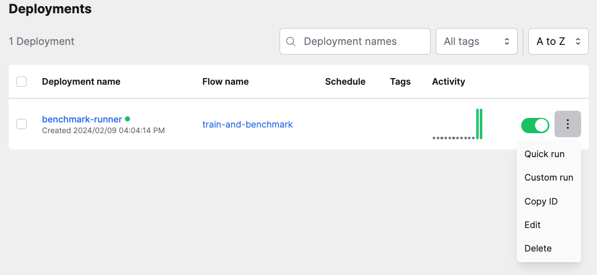

# Integrating nnbench with Prefect

If you have more complex workflows it is sensible to use a workflow orchestration tool to manage them. 
Benchmarking with nnbench can be integrated with orchestrators. We will present an example integration with Prefect.
We will explain the orchestration concepts in a high level and link to the corresponding parts of the  Prefect [docs](https://docs.prefect.io/).
The full example code can be found in the nnbench [repository](https://github.com/aai-institute/nnbench/tree/main/examples/prefect).

In this example we want to orchestrate the training and benchmarking of a linear regression model.

## Project Structure
### Defining the training tasks and workflows
We recommend to separate the training and benchmarking logic. 

```python
--8<-- "examples/prefect/training.py"
```

The `training.py` file contains functions to generate synthetic data for our regression model, facilitate a train-test-split, and finally train the regression model.
We have applied Prefect's [`@task` decorator.](https://docs.prefect.io/latest/concepts/tasks/). which marks the contained logic as a discrete unit of work for Prefect. 
Two other functions prepare the regression data and train the estimator. 
They are labeled with the [`@flow` decorator.](https://docs.prefect.io/latest/concepts/flows) that labels the function as a workflow that can depend on other flows or tasks.
The `prepare_regressor_and_test_data` function returns the model and test data so that we can use it in our benchmarks.

### Defining Benchmarks 
The benchmarks are in the `benchmark.py` file.
We have two functions to calculate the mean absolute error and the mean squared error.
These benchmarks are tagged to indicate they are metrics.
The other two benchmarks calculate calculate information about the model, namely the inference time and size of the model.

```python
--8<-- "examples/prefect/benchmark.py"
```

We did not apply any Prefect decorators here, as we will assign `@task`s - Prefects smallest unit of work - to run a benchmark family.

### Defining Benchmark runners.
In the `runners.py` file, we define the logic to run our benchmarks.
The runner collects the benchmarks from the specified file. 
We can filter by tags and use this to define two separate tasks, one to run the metrics and the other to run the metadata benchmarks. We have applied the `@task` decorator to these functions.

```python
--8<-- "examples/prefect/runner.py:18:37"
```

We have also defined a basic reporter that we will use to log the benchmark results with Prefect's logging machinery.

```python
--8<-- "examples/prefect/runner.py:10:15"
```
In a real-world scenario, we would report to a database and use a dedicated frontend to look at the benchmark results. But logging will suffice as we are only discussing integration with orchestrators here.

A final compound flow executes the model training, obtains the test set and supplies it to the benchmarks we defined earlier.

```python
--8<-- "examples/prefect/runner.py:40:52"
```

The final lines in the `runner.py` serve the `train_and_benchmark` function to make it available to Prefect for execution.

```python
--8<-- "examples/prefect/runner.py:55:56"
```

## Running Prefect
To run Prefect we have to do several things.
First, we have to make sure it is installed. You can use `pip install -U prefect`.
Then we have to run a Prefect server using `prefect server start`.
We make our benchmark flows available by executing it, `python runner.py`.
This enables us to now order an execution with the following command: `prefect deployment run 'train-and-benchmark/benchmark-runner'`.
The command should also be displayed in the output of the `runner.py` execution.

Now we can visit the local Prefect dashboard. By default it is on `localhost:4200`. 
Here we see the executed tasks and workflows.


If we navigate to the "Flow Runs" tab we see more details of the flow runs.


In the "Deployments" tab you see all deployed flows.
Currently, there is only our `train_and_benchmark` flow under the `benchmark-runner` name.
We can trigger a custom execution of workflows in the menu behind the three dots.



As you can see, the nnbench is easily integrated with workflow orchestrators by simply registering the execution of a benchmark runner as a task in the orchestrator.

For more functionality of Prefect, you can check out their [documentation](https://docs.prefect.io). 
